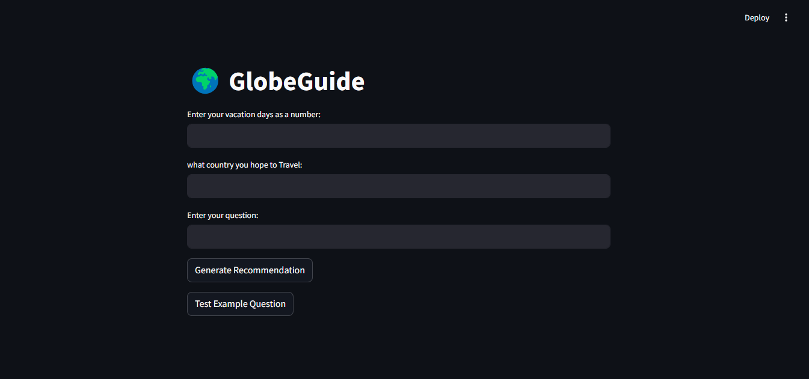

# LLM Application for Customized Travel Recommendations



## Installation
1. Clone this repository to your local machine:
   
```bash
   git clone https://github.com/DanukaDilshann/LLM-Application-for-Customized-Travel-Recommendations.git
```


2. Navigate to the project directory:
   
```bash
   cd LLM-Application-for-Customized-Travel-Recommendation
```

3. Install the required packages:
   
```bash
   pip install requirements.txt
```

## Running the Application
To launch the Streamlit app, execute the following command:

```bash
streamlit run Travel.py
```
